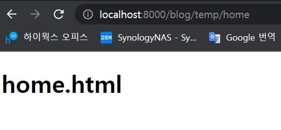
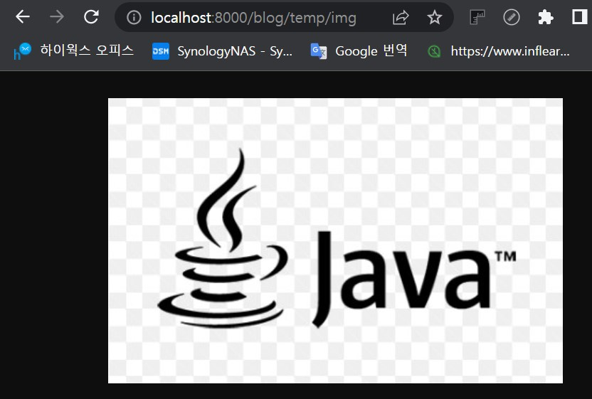
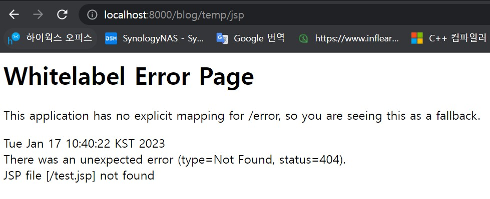
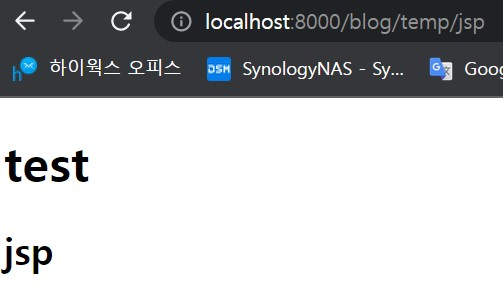

# **Spring Boot**  🎛️

 ## 💡 `Spring Boot` 


#### 1, 2차 완료 / 3차 초반

◾ **@Controller를 통한 파일 불러오기** <br>
- cf) @RestController는 문자를 리턴했다면 @Controller은 파일을 리턴한다. 

---




<br>
-> jsp 안 되던 것 <br>

<br>
-> return 타입과 파일명 동일하게(/test)<br>
--> src/main/webapp/WEB-INF/views/test.jsp


---

```
(메모란)

```

